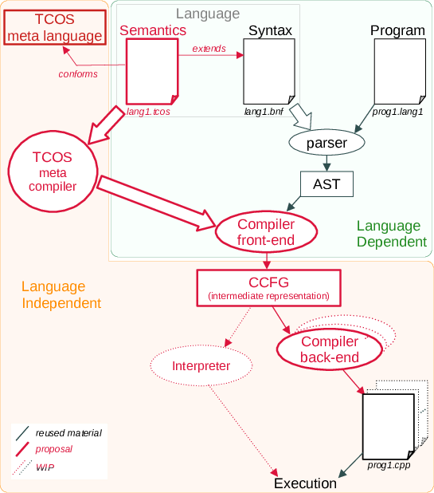
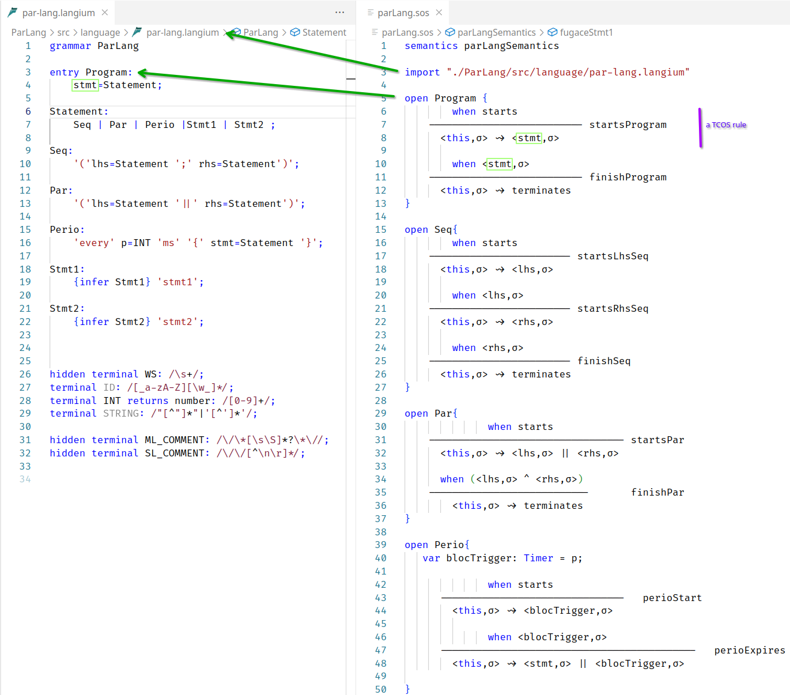
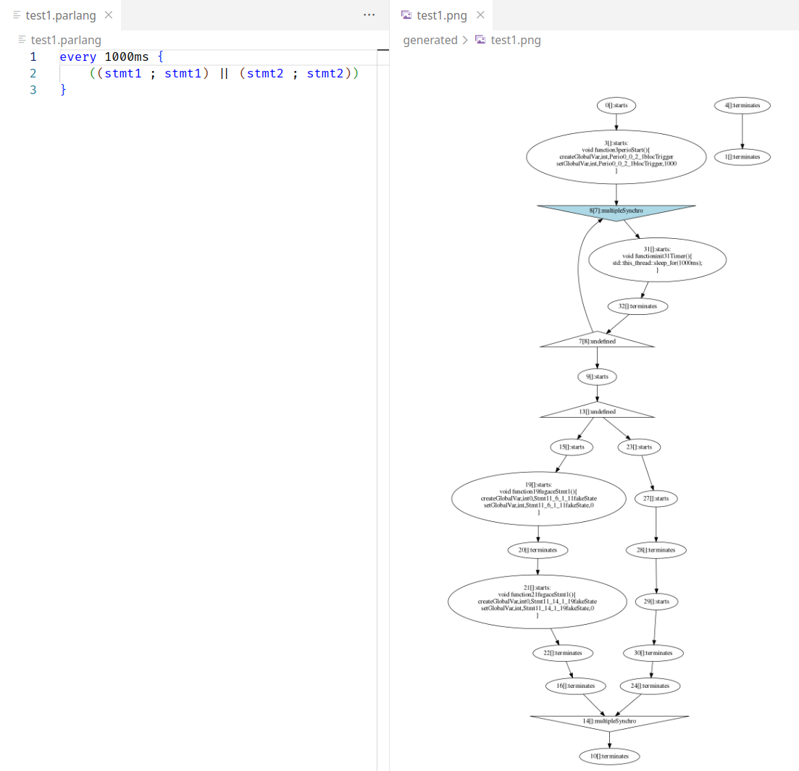

# TCOS.lang (Timed and Concurrent Operational Semantics)

 * [Overview](##overview)
    * [Conceptual Overview](###conceptualoverview)
    * [Technical Overview](###technicaloverview)
 * Usage
    * [As a Language Engineer](###asalanguageengineer)
    * [As a (Meta) Developper](###asa(meta)developper)

## Facts

TCOS is an open source language engineering tool. It provides a domain specific (meta) language for the definition of programmning language's behavioural semantics.

TCOS is particularly appropriate to programming languages embeeding concurrency and timing aspects. 

A TCOS specification is linked to a [(Langium) BNF](https://langium.org/) and specifies how to execute programs conforming the imported BNF.

A TCOS specification is amenable to the automatic generation of a compiler (tranpiler) for the imported language. Resulting code is free of any TCOS related library and can easily be embedded.

A main difference between TCOS and other language for behavioral semantics specification, is that it reifies the notion of *events* and *clocks* to ease the specification of timed and concurrent semantics. These notions are used to make explicit the control flow in a program instead of using pattern matching.

The project is still in infancy phase and is continously evolving.

If you're interested by any aspect of this language, please contact me, create issues or fork as wished.

If you're curious to see what a very simple TCOS specification looks like, see [./examples/languages/parLang.sos](./examples/languages/parLang.sos)

A more advanced example can be found [here]([./examples/languages/testFSE.sos]). Some others are in the pipes.

## Overview

### Conceptual Overview

TCOS is a meta-language used to specify the timed and concurrent operational semantics of a syntax given in an eBNF format. For a specific program $p$ in a language $L$, the TCOS semantics of $L$ specify the partial ordering among actions that alter the state of the program $p$.

To allow various implementations that satisfy the partial ordering corresponding to $p$, it is necessary to define a specific artifact that makes the partial order explicit and tractable (CCFG in Figure 1). This intermediate representation can then be compiled into various concrete parallelism mechanisms by different _back-ends. In TCOS, the intermediate representation is strongly influenced by existing works on Concurrent Control Flow Graphs (CCFG).

To automatically generate a compiler that converts a program into its corresponding CCFG (using only the behavioral semantics specification), we cannot rely on any pattern matching mechanism since it would require a symbolic execution of the program. Instead, we specify ordering conditions over the _start_ or _termination_ of actions that alter the program's state. Consequently, we reify concurrency concerns so that a semantic rule in TCOS has the form $P_{event} \rightarrow actions$, where $P_{event}$ is a --possibly conditional-- predicate over the start or termination of actions. When $P_{event}$ is satisfied, it implies $actions$, which is a partially ordered set of atomic or non-atomic actions.

### Technical Overview

We leveraged the Langium tooling, which automatically generates a parser for a language (along with convenient editing tools) from its extended BNF grammar specification. Any program conforming to the grammar can then be parsed to obtain a typed Abstract Syntax Tree (AST). Each node in the AST is an object instantiating a class.

In TCOS, the behavioral semantics imports the Langium grammar file. Inspired by attribute grammars and the Action Language for EMF, typed node definitions are _"re-opened"_ to include attributes that represent the contextualized state of the program.

Like attributes, rewriting rules are integrated into AST node definitions, providing a natural context for both the program's state and the rewriting rule. 

Based on these rule definitions, TCOS provides a meta-compiler, which automatically generates a compiler (front-end) for the language (see Figure 1). Any AST obtained by parsing a program conforming to the grammar can then be compiled to obtain a Concurrent Control Flow Graph (CCFG).

The semantics specification and the generated compiler front-end are inherently tied to the language being developed. However, the meta-compiler, the definition of a CCFG and the associated tooling are independent of the language. With any CCFG, different compiler back-ends can generate executable code that implements the actions in an order conforming to the partial order defined in the CCFG. The resulting code can then be executed. Additionally, the CCFG can be interpreted to facilitate program debugging or can be used for static analysis purposes.


<p align="center" width="100%">
    <a href="./docs/figures/TCOS_overview2.pdf" target=_blank> <br/></a>
        Figure 1. Overview of the TCOS tooling architecture
</p>


## Usage

### As a Language Engineer

TCOS is implemented in TypeScript and distributed as a VS-Code extension. checkout the code and starta vscode in the ```sos``` folder. ```npm i```, ```npm run build``` and ```F5``` will start a VS-Code with the TCOS extension deployed. If you want to use the example, open the [./examples/languages/](./examples/languages/) folder in the started VS-Code. It contains subfolders that contain *LSP ready Langium based grammar definition* (```npm i; npm run langium:generate; npm run build``` in subfolders to install the grammar, parser and editors). The folders have been initially generated by using the ```yo langium``` wizard.

The semantics definitions are for now at the root of the [./examples/languages/](./examples/languages/) folder. Their extension is *.sos*.

Figure 2 is a example of a langium grammar file and a corresponding TCOS semantics file. On the left side, the grammar, given in the Langium BNF format is provided. On the right side, the TCOS file is provided. A TCOS semantics has a name. Then it imports a langium grammar, which it decorates with rules defining the semantics. For instance line 5 to 13, the ```Program``` concept from the grammar is reopened and two rules are woven in it. Rule can navigate to attributes defined in the grammar (like the ```stmt``` attribute, defined in the grammar line 4 and used lines 8 and 10 in the TCOs file).

This README does not explain all the TCOS syntax but to give the flavor, the two first rules (defined lines 6 to 8 and 10 to 12) should be understood as 
> rule 1: when the semantics evaluation of a *Program* AST node *starts*, then the node *stmt* should be started in the same context σ.

> rule2: when the semantics evaluation of the *stmt* AST node *terminates*, then the associated program node terminates too.  

<p align="center" width="100%">
    <a href="./docs/screenshots/parLangScreenShot_annotated.png" target=_blank> <br/></a>
        Figure 2. Annotated screenshot of parlang syntax and semantics in their respective editors
</p>

Once the semantics is defined, the compiler front end can be generated by running: `node ../../sos/bin/cli.js generate parLang.sos -d ParLang/`. This generates the following file: `ParLang/src/cli/generated/parLang.ts`

This file contains the code to generate a Concurrent Control Flow Graph (CCFG) from any ParLang program. In order to test it, compile it (`npm run build` in the ParLang folder) and launch a new VS-Code extension that contains the extension for the Parlang editor and compiler. In the new VS-Code instance, open the [./examples/programs/](./examples/programs/) folder.

Below is an example of a ParLang program with the corresponding CCFG. The CCFG (and the C++ code) have been obtained by running: `node ../languages/ParLang/bin/cli.js generate test1.parlang`. Explanantions are not provided in this README by one can see that: 1) the program never terminates (its terminates node, on the right in the picture is not reachable from the start node); and 2) there is a cycle (initiated in the blue node).

<p align="center" width="100%">
    <a href="./docs/screenshots/parLangScreenShotProgramAndCCFG.png" target=_blank> <br/></a>
        Figure 3. A ParLang program and its corresponding CCFG
</p>


The dot file and the generated C++ code are provided in the `generated` folder. the generated code compile the easiest way: `g++ test1.cpp -o test1.exe`. These generated artefacts can be found in the [./examples/programs/generated](./examples/programs/generated) folder


### As a (Meta) Developper

TO BE DEFINED