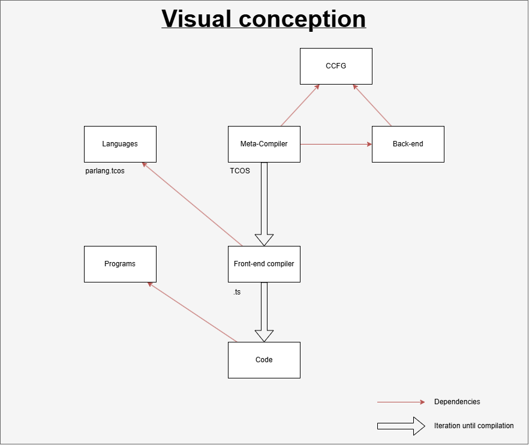

# TCOS Script — Maintenance Guide

## Important

If you modify the script, please update this documentation accordingly.

> _Leave the code cleaner than you found it._

---

## Table of contents

1. [Adding a new package or language](#1-adding-a-new-package-or-language)
   - [1.1. New package](#11-new-package)
   - [1.2. New language](#12-new-language)
   - [1.3. Removing a language](#13-removing-a-language)
2. [Adding a new test program](#2-adding-a-new-test-program)
3. [Adding a target format](#3-adding-a-target-format)
4. [Debugging the watcher](#4-debugging-the-watcher)
    - [4.1. File-to-node matching](#41-file-to-node-matching)
    - [4.2. Watched and ignored paths](#42-watched-and-ignored-paths)
5. [Architecture overview](#5-architecture-overview)
    - [5.1. Entry point and dispatch](#51-entry-point-and-dispatch)
    - [5.2. Batch mode implementation notes](#52-batch-mode-implementation-notes)
    - [5.3. Watch mode implementation notes](#53-watch-mode-implementation-notes)
    - [5.4. Inter file dependencies](#54-inter-file-dependencies)
6. [Future work](#6-future-work)
7. [Related documentation](#7-related-documentation)


## 1. Adding a new package or language

### 1.1. New package

To add a new package or to modify an existing one and test your changes through the script — add an entry to the static `DAG` structure in `src/project.ts`.

If your package name contains uppercase letters, update the `getNodePath` function in `src/utils.ts` accordingly, because the folder name on disk is derived from the package name using a case-sensitive convention.

> **⚠️ Warning**
>
> Respect the dependency order. The installer iterates over `DAG` in the order the keys are declared, and `npm link` requires each dependency to be globally available before any dependent package is built. Listing a package before its prerequisites will fail at the link step.
>
> The invariants of the `DAG` (Directed Acyclic Graph) to be respected:
>
> 1. No cycles in the graph.
> 2. Each key must use a casing consistent with the folder on disk, or be listed in the casing map of `getNodePath`.
> 3. Every language must list `tcos` in its `dependsOn`, because TCOS generates the language's front-end compiler. This is a business rule, not enforced by the type system.

The `DAG` serves two purposes:

1. It drives installation and dependency linking for all packages (`npm i`, `npm link`, `npm run build`).
2. It is used for cascading rebuilds via `npm run watch`, making it easier to track the impact of a change across the codebase.

```ts
export const DAG: Record = {
    "ccfg": {
        folder: "packages",
        dependsOn: []
    },
    "backend-compiler": {
        folder: "packages",
        dependsOn: ["ccfg"]
    },
    "interpreter": {
        folder: "packages",
        dependsOn: ["ccfg", "backend-compiler"]
    },
    "tcos": {
        folder: "packages",
        dependsOn: []
    },
    // ---- packages above, languages below ----
    "ParLang": {
        folder: "examples/languages",
        dependsOn: ["ccfg", "backend-compiler", "tcos"]
    },
    "simpleL": {
        folder: "examples/languages",
        dependsOn: ["ccfg", "backend-compiler", "tcos"]
    },
    "fsm": {
        folder: "examples/languages",
        dependsOn: ["ccfg", "backend-compiler", "tcos"]
    }
};
```

Below is a visual representation of the DAG:

<p align="center" width="100%">
    <a href="../docs/figures/Visual_conception.png" target="_blank">
        
    </a>
</p>

### 1.2. New language

To create a new front-end compiler (i.e. a new language) and test it through the script, add an entry both in the static `LANGUAGES` structure and in the `DAG`.

If a language is not declared in `LANGUAGES`, the script will skip it because it does not recognize its extension.

A new language must declare:

- Its **file extension**, used to identify the source programs it accepts;
- Its **npm links**, which create symbolic links from `node_modules/` to the global packages it depends on;
- Its **semantic definition file** (`.tcos` or `.sos`), used by the meta-compiler to generate the front-end compiler.

```ts
export const LANGUAGES: Record = {
    "ParLang": {
        extension: ".parlang",
        npmLinks: ["ccfg", "backend-compiler"],
        tcosFile: "parlang.tcos"
    },
    "simpleL": {
        extension: ".simple",
        npmLinks: ["ccfg", "backend-compiler"],
        tcosFile: "simpleL.tcos"
    },
    "fsm": {
        extension: ".fsm",
        npmLinks: ["ccfg", "backend-compiler"],
        tcosFile: "testFSM.sos"
    }
};
```

Once the language is declared in both `LANGUAGES` and the `DAG`, you can modify a file in the `ccfg` package and run `npm run watch`. The script will rebuild all packages and languages, letting you verify that the new front-end compiler produced by the meta-compiler TCOS still builds correctly.

A `DAG` entry requires the following shape:

```ts
export interface NodeInfo {
    folder: string;
    dependsOn: string[];
}
```

The new language must be inserted into the `DAG` alongside the existing entries, after the packages:

```ts
export const DAG: Record = {
    // ... packages above, languages below ...
    "ParLang": {
        folder: "examples/languages",
        dependsOn: ["ccfg", "backend-compiler", "tcos"]
    },
    "simpleL": {
        folder: "examples/languages",
        dependsOn: ["ccfg", "backend-compiler", "tcos"]
    },
    "fsm": {
        folder: "examples/languages",
        dependsOn: ["ccfg", "backend-compiler", "tcos"]
    }
    // <-- add your new language here
};
```

### 1.3. Removing a language

To remove a language that has been abandoned:

1. Remove its entry from `DAG` in `src/project.ts`.
2. Remove its entry from `LANGUAGES` in `src/project.ts`.
3. Delete the folder `examples/languages/<name>/` on disk.
4. Delete every test program in `examples/programs/` that uses this language's extension.

## 2. Adding a new test program

To add a new test program, drop the source file (`test42.parlang`, `myCase.simple`, etc.) in `examples/programs/`. No configuration is required:

- The batch mode discovers programs automatically based on registered language extensions (`LANGUAGES[lang].extension`).
- The watch mode also detects direct edits to these files and performs single-file regeneration.

## 3. Adding a target format

A target format is the output language produced by each language's compiler (C++, Python, JavaScript). Adding a new format is the most invasive change documented here: it touches the script, the back-end compiler, and every language's CLI.

The procedure is:

1. **Create a new generator file** in `packages/backend-compiler/` (e.g. `javaGenerator.ts`). It must implement the `GeneratorInterface` so that each language's CLI can dispatch to it when the new format is requested.
2. **Update each language's CLI** in `examples/languages/<lang>/src/cli/main.ts` so that it recognizes the new format argument and forwards it to the appropriate generator.
3. **Declare the format** in `TARGET_FORMATS` in `src/project.ts`. The order in this array drives the order shown in interactive prompts and batch summaries.

```ts
export const TARGET_FORMATS = ["C++", "Python", "JavaScript", "Java"];
```

## 4. Debugging the watcher

When using `npm run watch`, several protective layers exist that you should be aware of when something does not behave as expected.

### 4.1. File-to-node matching

The function `findNode` in `src/utils.ts` checks whether the modified file matches a DAG node (either inside its source folder or via a TCOS specification file at the root of `examples/languages/`), or a program in `examples/programs/`. This is what determines whether the script regenerates only the modified program or rebuilds the full cascade from a DAG node.

### 4.2. Watched and ignored paths

In `src/watcher.ts`, the chokidar configuration declares which folders and file types are watched. By design, folders containing generated artifacts are excluded — `dist/`, `node_modules/`, `out/`, and any folder named `generated`:

```ts
ignoreInitial: true,
ignored: (filePath, stats) => {
    const banFolder = ["node_modules", "out", "dist", "generated"];
    for (const name of banFolder) {
        if (filePath.includes(name)) return true;
    }
    if (stats?.isFile() &&
        !(
            filePath.endsWith(".ts")
            || Object.values(LANGUAGES).some(config => filePath.endsWith(config.extension))
            || filePath.endsWith(".langium")
            || filePath.endsWith(".tcos")
            || filePath.endsWith(".sos")
        )
    ) return true;
    return false;
}
```

> **⚠️ Warning**
>
> If you modify a file inside one of the ignored folders, you will need to restart the script manually. Watching these folders would create an infinite rebuild loop, since each rebuild writes back into them.

If you introduce files with a new extension, remember to add it to the watcher's allow-list above, unless they live in one of the banned folders.

## 5. Architecture overview

### 5.1. Project layout

```tree
📁 scripts/
├── 📁 src/
│   ├── 📄 commands.ts
│   ├── 📄 display.ts
│   ├── 📄 generation.ts
│   ├── 📄 index.ts
│   ├── 📄 installation.ts
│   ├── 📄 project.ts
│   ├── 📄 state.ts
│   ├── 📄 types.ts
│   ├── 📄 utils.ts
│   ├── 📄 verification.ts
│   └── 📄 watcher.ts
├── 📄 package-lock.json
├── 📄 package.json
├── 📄 script-installation.md
└── 📄 tsconfig.json
```


| File              | Role                                                                                                                                                                                                                                  |
|-------------------|---------------------------------------------------------------------------------------------------------------------------------------------------------------------------------------------------------------------------------------|
| `index.ts`        | Entry point. Parses CLI flags and dispatches to the selected mode.                                                                                                                                                                    |
| `installation.ts` | Runs the install pipeline (`npm i`, `npm audit fix`, `npm link`, `npm run build`) for every package in `packages/` and every language in `examples/languages/`. For languages, runs `npm run langium:generate` and the TCOS CLI before the build. |
| `generation.ts`   | Batch generation of every program in all three formats (C++, Python, JavaScript) with `--debug`, plus single-program regeneration triggered by the watcher.                                                                           |
| `watcher.ts`      | chokidar-based file watcher. Triggers cascading rebuilds on DAG node changes and single-file regenerations on test program changes. Aborts in-flight builds when a newer change arrives.                                              |
| `commands.ts`     | Executes shell commands as child processes, forwards their output streams, and supports cancellation via abort signal.                                                                                                                |
| `display.ts`      | Terminal output: colored logs, indentation, end-of-run summaries, ASCII-art banners per mode.                                                                                                                                         |
| `utils.ts`        | Watcher helpers: DAG traversal (`buildDependants`, `computeCascade`), file-to-node matching (`findNode`, `getNodePath`), abort checking (`checkAbort`), mode banners (`changeMod`).                                                   |
| `project.ts`      | Static project structure: `DAG`, `LANGUAGES`, `TARGET_FORMATS`, paths.                                                                                                                                                                |
| `state.ts`        | Mutable runtime flags shared across the script (`isInteractive`, `isVerbose`).                                                                                                                                                        |
| `types.ts`        | Shared TypeScript types and interfaces.                                                                                                                                                                                               |
| `verification.ts` | CCFG verification against expected references. Currently unused (see [Future work](#6-future-work)).                                                                                                                                  |

### 5.2. Entry point and dispatch

`src/index.ts` parses the CLI flags (`--batch`, `--watch`, `--all`) and dispatches to the corresponding mode. All modes share the same initial pipeline — `installAllPackages` followed by `installAllLanguages`, both from `src/installation.ts`. Only what happens *after* installation differs between modes.

| Mode  | Command          | Driving module       |
|-------|------------------|----------------------|
| Batch | `npm run batch`  | `src/generation.ts`  |
| Watch | `npm run watch`  | `src/watcher.ts`     |

The observable behavior of each mode (what the user sees, the order of steps, the special cases) is documented in the [usage guide](./script-usage-guide.md). This section covers only the implementation choices relevant to maintenance.

### 5.3. Batch mode: implementation notes

`generateBatch` discovers programs through `discoverPrograms` (it reads `examples/programs/` and filters by extensions registered in `project.ts`), builds each command with `buildGenerationCommand`, and runs it through `executeCommand` from `src/commands.ts`. Results are aggregated and passed to `printFullSummary`.

The process exit code reflects whether at least one command failed — this is the property that makes the mode usable in CI.

### 5.4. Watch mode: implementation notes

The watcher relies on three pieces of state that live for the entire duration of the process:

- **The chokidar instance**, configured with `persistent: true` to prevent Node from terminating. It watches the folders of every DAG node plus `examples/programs/`.
- **The `dependents` map**, computed once at startup by `buildDependants` (`src/utils.ts`). It is the inverse of the DAG for each node, the list of its direct dependents. Cached at module level, never recomputed.
- **The current `AbortController`**, replaced on every new file change. When it is replaced, the previous one is signalled and the running shell command receives `SIGTERM` via `executeCommand`.

On each chokidar event, `findNode` determines whether the path corresponds to a DAG node or a test program, and `computeCascade` returns the node plus all its transitive dependents in topological order. The chaining logic (cascade, abort, regeneration) is described on the usage side.

### 5.5. Inter-file dependencies

```tree
index.ts
├── installation.ts
│   ├── commands.ts
│   └── display.ts
├── generation.ts
│   ├── commands.ts
│   └── display.ts
└── watcher.ts
    ├── utils.ts
    ├── generation.ts
    ├── commands.ts
    └── display.ts
```

Imported by every module: `project.ts`, `state.ts`, `types.ts`.

## 6. Future work

- **[`getNodePath`](./src/utils.ts):** This function currently handles casing exceptions (`ccfg` -> `CCFG`, `tcos` -> `TCOS`) inline. As more packages or languages are added with mixed casing, it would be cleaner to introduce an explicit `folderName` field in `NodeInfo` (in `src/project.ts`) and remove the inline mapping. This decouples the DAG keys from the on-disk folder names.

- **[`verification.ts`](./src/verification.ts):** As mentioned in [`script-usage-guide.md`](./script-usage-guide.md), this file is reserved for regression testing of generated CCFGs against known-correct references. The initial implementation based on `@graphty/algorithms` could not handle symmetric CCFGs (timeouts beyond 10 seconds on 8 of 10 test programs). A simpler comparison strategy is pending validation with the project lead. Reintegrating this feature would let the project safely commit and push programs whose generated outputs are verified to be correct.

## 7. Related documentation

- [README](../README.md)
- [Usage guide](./script-usage-guide.md)